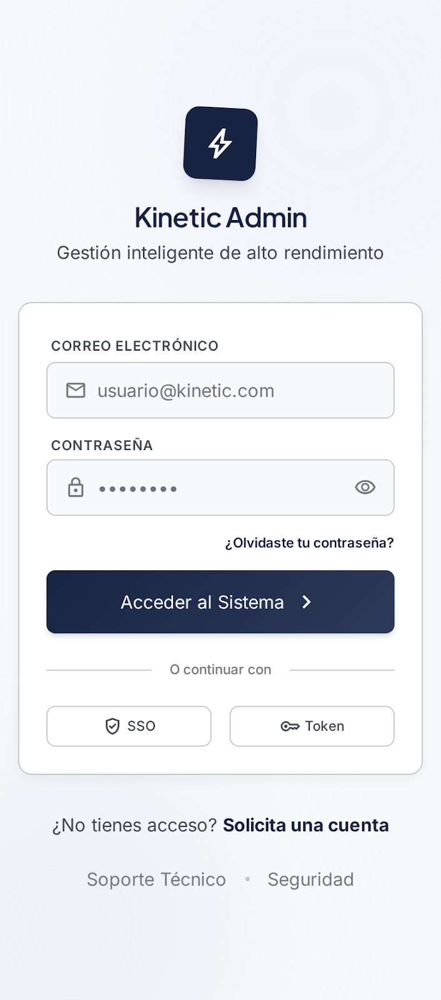
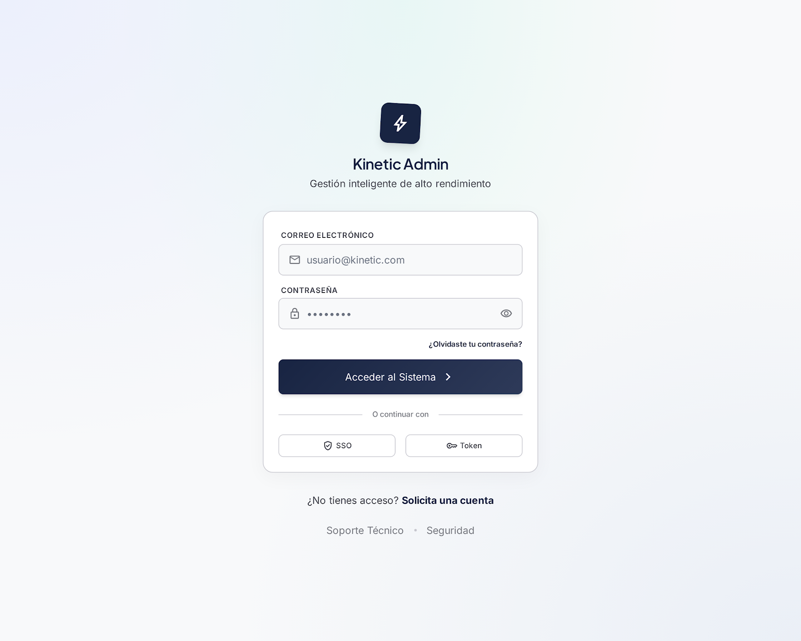
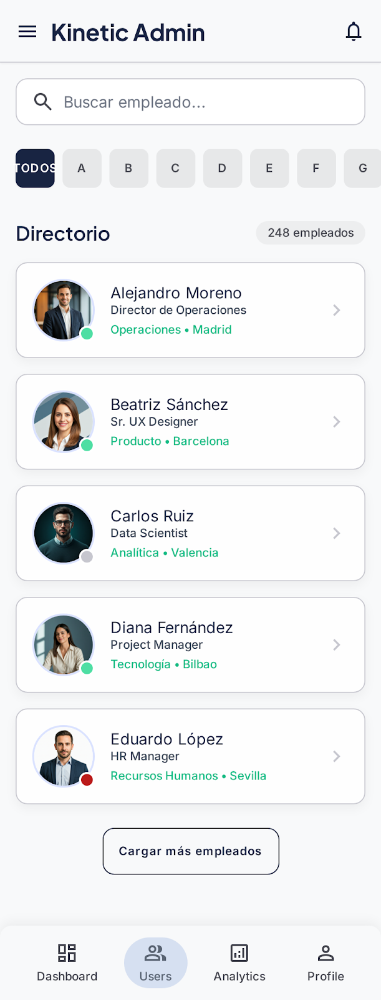
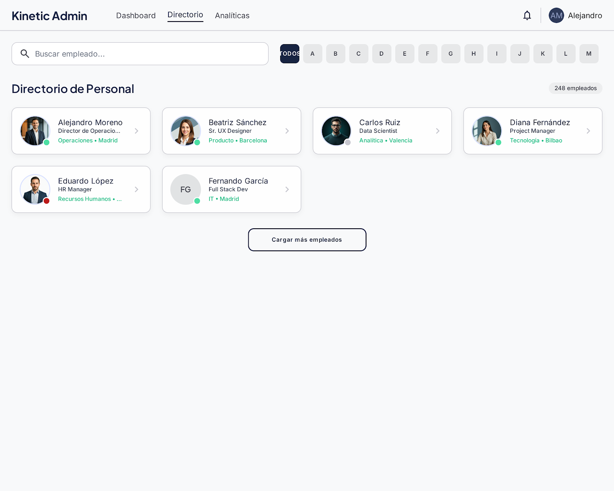
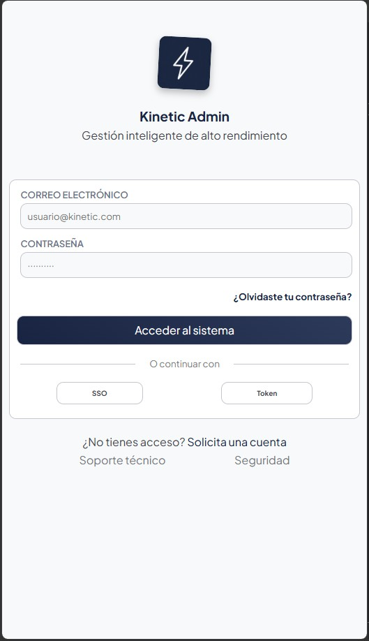

# Kinetic Admin - Gestión inteligente de alto rendimiento

Kinetic Admin, la próxima página de gestión inteligente de alto rendimiento en la cual... ¿solo se puede ver una lista de empleados?

Para este proyecto se nos ha propuesto hacer una página estilo dashboard administrativo con una página de log in que requiera un e-mail y una contraseña, con tan solo un admin, y una galería de empleados, la cual se obtendrá mediante una API externa y **deberá** filtrarse por nombre. Sencillito, ¿no?

## Planificación

Para empezar, como en todos los proyectos de este estilo, he escogido Stitch, la IA de Google, para realizar unos bocetos con los que me he acabado quedando. Desde aquí, planifiqué un poco por encima la estructura del proyecto. Como se nos pide una página de inicio de sesión y una galería de empleados, esas son las dos páginas sobre las que trabajaremos.

### Capturas de pantalla:

| Página | Mobile | Responsive |
|---|---|---|
| **Login** |  |  |
| **User gallery** |  |  |

Seguidamente, con Figma se prepararon los bocetados del proyecto (ver más en: )

---

## Primera página - Página de acceso o login

Esta página, aunque de buenas a primeras pueda parecer sencilla, cuenta con un script de validación para el email y la contraseña de un supuesto administrador. Este email es **específico** del administrador, y usar cualquier otro devolvería un error y no permitiría el avance a la siguiente página. El email y la contraseñas están especificados en el [config.js](./src/scripts/validation-form/config.js), pero para mayor y mejor legibilidad los dejo por aquí:

- email: giaco@kinetic-adming .com
- contraseña: admin12kinetic

La página está dividida en tres grandes partes: el branding area o mensaje de bienvenida, el formulario de inicio de sesión y un área dedicada únicamente al soporte técnico.

El form de inicio de sesión cuenta con inputs para el email, la contraseña y un botón estilo submit para acceder al sistema, a parte de funciones implementadas, que no funcionales, que le dan a la página algo de estilo. Entre ellas se encuentra un link a una supuesta página de formulario de cambio de contraseña, dos formas más de acceder a tu cuenta: mediante `SSO`, inicio de sesión único o, lo que es lo mismo, un método de autenticación que permite a los usuarios iniciar sesión en varias aplicaciones y sitios webs con único set de credenciales, y el inicio mediante `Token`, una autenticación basada en permitir acceder a tu aplicación sin introducir credenciales y mediante una cadena de texto y números cifrada y única. Por supuesto, ninguna de estas implementaciones son funcionales y al clicar sobre ellas no lleva a ningún sitio importante.

La tercera y última parte de esta login page es un área, como ya hemos dicho, de soporte técnico. Aquí encontramos un pequeño mensaje que indica que si usted no tiene cuenta, por favor solicite una. Asímismo, debajo encontramos dos links: `Soporte técnico` y `Seguridad`. Ninguno de estos links, por supuesto, es funcional, pero le añaden un aire de acabado profesiona a la página y la estetiza lo suficiente como para ser considerado un MVP.

### Capturas de pantalla

| Mobile | Responsive |
|---|---|
| | Responsive-Result |
