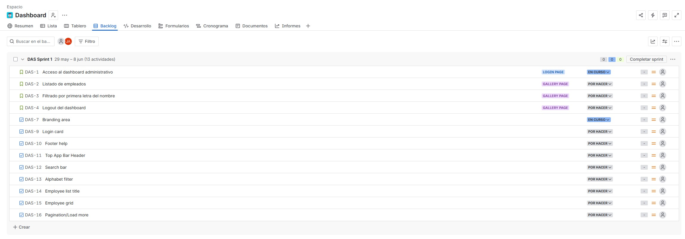
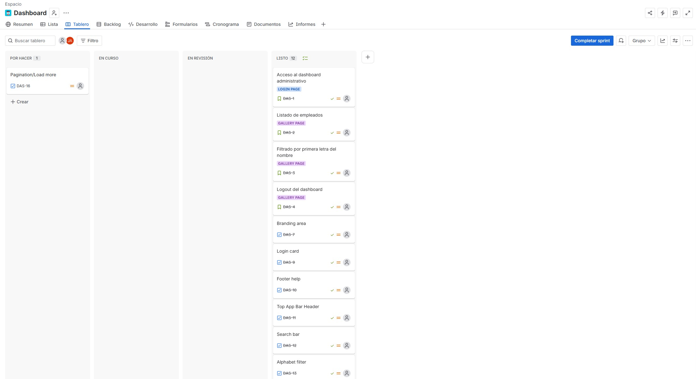
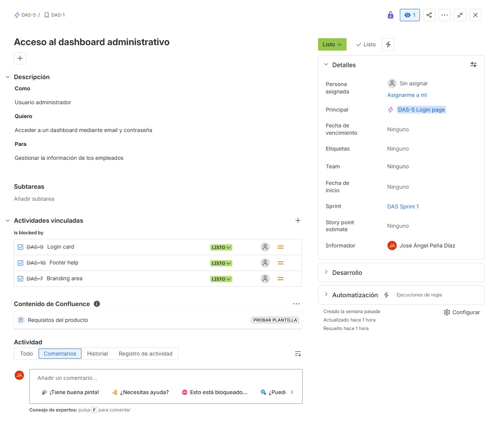
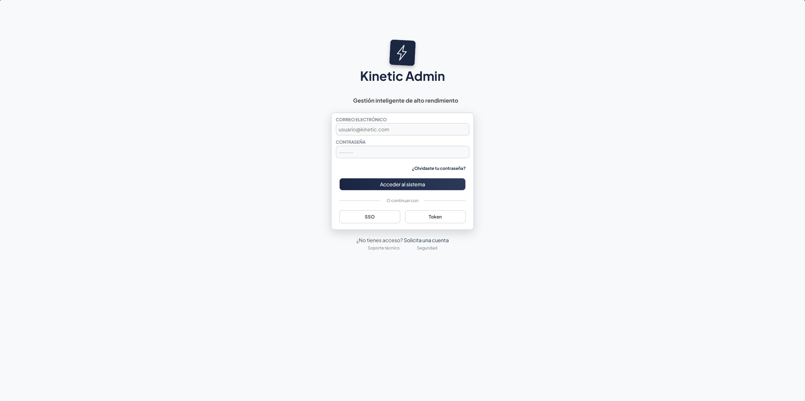
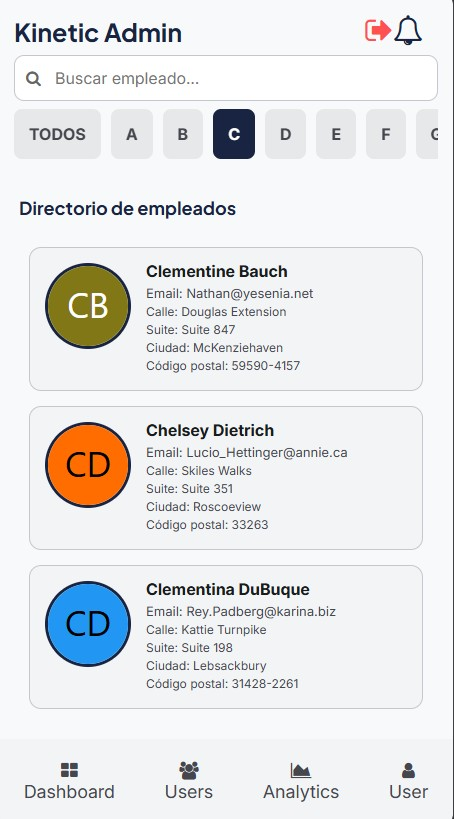
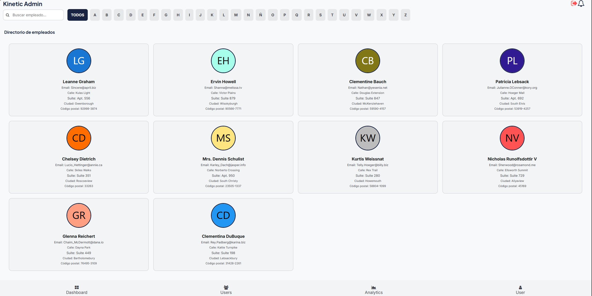

# Kinetic Admin - Gestión inteligente de alto rendimiento

Kinetic Admin, la próxima página de gestión inteligente de alto rendimiento en la cual... ¿solo se puede ver una lista de empleados?

Para este proyecto se nos ha propuesto hacer una página estilo dashboard administrativo con una página de log in que requiera un e-mail y una contraseña, con tan solo un admin, y una galería de empleados, la cual se obtendrá mediante una API externa y **deberá** filtrarse por nombre. Sencillito, ¿no?

## Planificación

Para empezar, generé un equipo en Jira con el cual organizarme y crear historias de usuario. Seguí un poco las provistas por el enunciado. Generé unas historias de usuario, épicas y tareas sobre las cuales organicé mi trabajo y que seguí prácticamente a rajatabla a la hora de crear el diseño de la página.

| Backlog | Tablero | Ejemplo de historia de usuario |
|---|---|---|
|  |  |  |

A continuación, como en todos los proyectos de este estilo, he escogido Stitch, la IA de Google, para realizar unos bocetos con los que me he acabado quedando. Desde aquí, planifiqué un poco por encima la estructura del proyecto. Como se nos pide una página de inicio de sesión y una galería de empleados, esas son las dos páginas sobre las que trabajaremos.

### Capturas de pantalla:

| Página | Mobile | Responsive |
|---|---|---|
| **Login** |  |  |
| **User gallery** |  |  |

Seguidamente, con Figma se prepararon los bocetados del proyecto (ver más en: [Proyecto de Figma](https://www.figma.com/design/gCDNt128xmyC3k2zKAZz19/Dashboard?node-id=0-1&p=f&t=OW4fUORMEcZoGXM7-0)).

---

## Primera página - Página de acceso o login

Esta página, aunque de buenas a primeras pueda parecer sencilla, cuenta con un script de validación para el email y la contraseña de un supuesto administrador. Este email es **específico** del administrador, y usar cualquier otro devolvería un error y no permitiría el avance a la siguiente página. El email y la contraseñas están especificados en el [config.js](./src/scripts/validation-form/config.js), pero para mayor y mejor legibilidad los dejo por aquí:

- email: giaco@kinetic-admin .com
- contraseña: admin12kinetic

La página está dividida en tres grandes partes: el branding area o mensaje de bienvenida, el formulario de inicio de sesión y un área dedicada únicamente al soporte técnico.

El form de inicio de sesión cuenta con inputs para el email, la contraseña y un botón estilo submit para acceder al sistema, a parte de funciones implementadas, que no funcionales, que le dan a la página algo de estilo. Entre ellas se encuentra un link a una supuesta página de formulario de cambio de contraseña, dos formas más de acceder a tu cuenta: mediante `SSO`, inicio de sesión único o, lo que es lo mismo, un método de autenticación que permite a los usuarios iniciar sesión en varias aplicaciones y sitios webs con único set de credenciales, y el inicio mediante `Token`, una autenticación basada en permitir acceder a tu aplicación sin introducir credenciales y mediante una cadena de texto y números cifrada y única. Por supuesto, ninguna de estas implementaciones son funcionales y al clicar sobre ellas no lleva a ningún sitio importante.

La tercera y última parte de esta login page es un área, como ya hemos dicho, de soporte técnico. Aquí encontramos un pequeño mensaje que indica que si usted no tiene cuenta, por favor solicite una. Asímismo, debajo encontramos dos links: `Soporte técnico` y `Seguridad`. Ninguno de estos links, por supuesto, es funcional, pero le añaden un aire de acabado profesiona a la página y la estetiza lo suficiente como para ser considerado un MVP.

### Capturas de pantalla

| Mobile | Responsive |
|---|---|
| |  |

---

## Segunda página - Página de galería de empleados

A esta página se accede únicamente tras introducir las credenciales correctas. Consta de tres grandes partes: un header, una página de galería y un footer.

La primera parte, el header, cuenta con el nombre de la página y dos iconoes: un icono para hacer log-out y un icono de notificación, de los cuales tan solo el de log-out es funcional. Este icono, una vez pulsado, te redigirá a la página de login.

La segunda parte, la más llena de contenido, es una galería de empleados que mediante un script se renderizan únicamente siguiendo unos patrones específicos. Por encima de esta galería tenemos una barra de búsqueda para filtrar más rápidamente y encontrar al empleado deseado y una nav-bar llena de inputs para filtrar por la primera letra del nombre. Este filtrado renderiza a los empleados que coincidan; si ningún empleado cumple los criterios, dicha página deolverá un mensaje de 'No se encontraron empleados'.

Asimismo, esta galería muestra una serie de parámetros pedida por el cliente: `Email`, `calle`, `suite`, `ciudad` y `código postal`, al igual que el nombre y un icono generado de forma artificial a falta de fotos oficiales de los supuestos trabajadores.

**NOTA:** En el modo mobile y si se ve desde el ordenador, deberá scrollear manteniendo pulsada la tecla `SHIFT` (`SHIFT` + `SCROLL-UP/SCROLL-DOWN`), pues la barra de scroll horizontal se ha eliminado por motivos estéticos. Si se hace desde el móvil no habrá problema alguno: el scroll se comporta tal y como debería.

La última parte es completamente estética y nada funcional. Es un footer con un nav-bar que incluye iconoes y texto para cuatro importantes partes de una aplicación Dashboard completa: `Dashboard`, `Users`, `Analytics` y `Usuario`. En el modo web, esta nav-bar debería transportarse a la zona superior, al header, y desaparecería del fondo de la página, pero no ha dado tiempo a ser implementado, por lo que se mantiene al fondo de la página, siendo tomada la decisión de entregar un MVP funcional por encima de uno sin acabar.

### Capturas

| Mobile | Responsive |
|---|---|
| |  |

---

## Tests

Finalmente, se han intentado realizar tests de los scripts de login y renderizado de galería, pero por falta de tiempo no se han podido implementar. La intención era realizarlos con Vitest y proporcionar en capturas de pantalla los tests proporcionados. Al no haberse implementado ninguno, lamentablemente esta sección se mantiene vacía.

---

## Conclusiones

Finalmente, este proyecto ha sido realizado por Jose Ángel Peña Díaz, alumno del bootcamp P5 Digital Academy. Se ha intentado entregar un producto viable con las especificaciones requeridas por el cliente, y aunque no se ha llegado a algunos puntos pedidos, el proyecto es funcional y sus requerimientos, en su mayoría, se cumplen.

### Herramientas usadas

- `Jira`: Para la planificación del proyecto
- `Stitch` & `Figma`: Para el bocetado y creación de mockups
- `HTML5`: Para la estructura de la página web
- `CSS3`: Para los estilos
- `JavaScript`: Para los scripts
- ~~`Vitest`: Para los tests~~
- ~~`PlayWright`: Para los tests E2E~~

### Bases de datos

- `MDN`
- `Stack Overflow`
- `W3Schools`